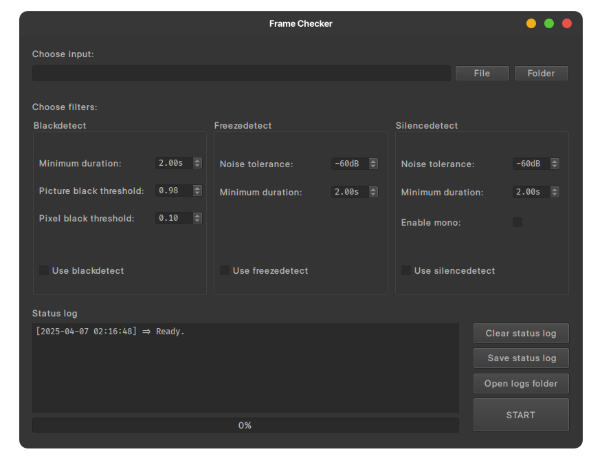
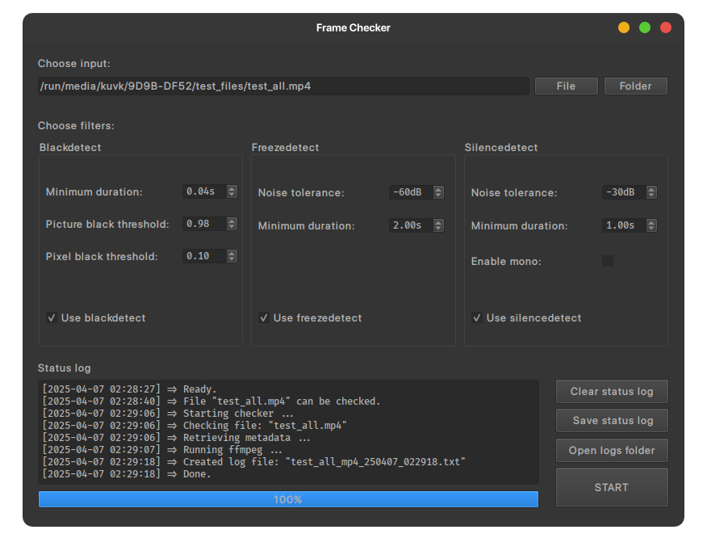
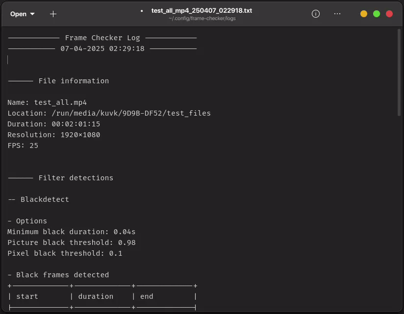

# &nbsp;Frame Checker

Frame Checker is a PySide6 application for checking video frames using ffmpeg filters. 
It helps detect black and frozen frames, as well as silence in video files using a 
user-friendly interface. It's available on **Linux, macOS, and Windows**.



Frame Checker will use ffmpeg with selected filters and generate logs if any detections 
are made, converting detections to **SMPTE** (hours:minutes:seconds:frames) format for 
easy integration into video editing workflows.

Currently three ffmpeg filters are supported: **blackdetect**, **freezedetect**, 
**silencedetect**.

---

## Table of Contents

- [Features](#features)
- [Installation](#installation)
  - [Requirements](#requirements)
  - [Linux](#linux)
    - [Arch](#arch)
    - [Debian](#debian)
  - [macOS](#macos)
  - [Windows](#windows)
- [Usage](#usage)
  - [Quick Start](#quick-start)
  - [Detection Log Example](#detection-log-example)
- [Settings](#settings)
  - [General](#general)
  - [Filter options](#filter-options)
- [What's next?](#whats-next)
- [FAQs](#faqs)
- [Credit](#credit)
- [License](#license)

---

## Features

- Detects black frames, frozen frames, and silence in video files.
- Outputs timestamps in **SMPTE** format for seamless video editing workflows.
- Cross-platform support for **Linux**, **macOS**, and **Windows**.
- Provides a simple GUI for setting filters and analyzing videos.
- Customizable settings to fit specific user workflows.
- Automatically generates detailed logs for detected events.

---

## Installation

To install Frame Checker, follow the instructions for your operating system.

### Requirements

- [ffmpeg](https://ffmpeg.org/download.html) must be installed and added to PATH.

  - On **Windows** and **macOS**, ffmpeg can be installed during the Frame Checker 
  installation process.
  - On **Linux**, ffmpeg is listed as a dependency in the package.

- **Python 3.10** or higher is required on **Linux** for the app to work as expected.

---

### Linux

#### Arch

- Download the [latest Arch package](https://github.com/kuvk/frame-checker/releases/download/v1.0.0/frame-checker-1.0-1-x86_64.pkg.tar.zst).
- Navigate to the directory where you downloaded the package and run:
  ```bash
  sudo pacman -U frame-checker-1.0-1-x86_64.pkg.tar.zst
  ```
- to **uninstall**:
  ```bash
  sudo pacman -R frame-checker
  ```

#### Debian

- Download the [latest Debian package](https://github.com/kuvk/frame-checker/releases/download/v1.0.0/frame-checker_1.0-1_all.deb).
- Navigate to the directory where you downloaded the package and run:
  ```bash
  sudo apt install ./frame-checker_1.0-1_all.deb
  ```
- to **uninstall**:
  ```bash
  sudo apt remove frame-checker
  ```

---

### macOS

- Download the appropriate installer from [Releases](https://github.com/kuvk/frame-checker/releases):
  - Universal (`universal2`): [frame-checker-1.0-1-universal2.pkg](https://github.com/kuvk/frame-checker/releases/download/v1.0.0/frame-checker-1.0-1-universal2.pkg)
  - Intel (`x86_64`): [frame-checker-1.0-1-x86_64.pkg](https://github.com/kuvk/frame-checker/releases/download/v1.0.0/frame-checker-1.0-1-x86_64.pkg)
  - Apple Silicon (`arm64`): [frame-checker-1.0-1-arm64.pkg](https://github.com/kuvk/frame-checker/releases/download/v1.0.0/frame-checker-1.0-1-arm64.pkg)

- During installation, you will be **prompted to install ffmpeg**. Clicking Yes 
will start [install ffmpeg](macos/install_ffmpeg.sh) script, which will install 
[Homebrew](https://brew.sh/) package manager and use it to install ffmpeg. In case 
you already have Homebrew, you can skip this step and just run `brew install ffmpeg`, 
it is exactly what the script does. 

- If you are **installing ffmpeg manually**, ensure that ffmpeg binaries are linked 
somewhere in this PATH:
  ```bash
  PATH=/usr/bin:/bin:/usr/sbin:/sbin:/usr/local/bin:/opt/homebrew/bin 
  ```
  or Frame Checker won't be able to use them. (Eg. `/usr/local/bin/ffmpeg` and 
  `/usr/local/bin/ffprobe`)

---

### Windows

- Download the [Windows installer](https://github.com/kuvk/frame-checker/releases/download/v1.0.0/frame-checker-1.0-1-win_x64.exe) 
and run it.

- Ensure that **"Install FFmpeg" option is checked** during setup. This will start 
[install ffmpeg](windows/install_ffmpeg.bat) script, which will download latest 
ffmpeg release and install it in `C:\ffmpeg`. If you choose to leave it unchecked, 
ensure that ffmpeg is installed and added to the PATH.

**Note**: Windows and macOS installers are self-signed, so you'll probably get unidentified developer warnings.

---

## Usage

### Quick Start

1. Open Frame Checker.
2. Select a video file or directory to analyze.
3. Select the desired filters (e.g., **Blackdetect**, **Freezedetect**, **Silencedetect**).
4. Adjust filter options as needed.
5. Click **Start Checker** to process the video.
6. Click **Open logs folder** to view results.



---

### Detection Log Example

Below is an example of a detection log generated by Frame Checker:

<div align="center">
  
</div>

---

## Settings

During startup, Frame Checker will create necessary config directory with `setting.ini`.

- On Windows and MacOS config directory will be created under `Documents/Frame Checker`.
- On Linux it will default to `/home/user/frame-checker`, unless `XDG_CONFIG_HOME` is set.

### General

Customize general application settings in `settings.ini` under `[app]` section:
- **Theme** (dark or light).
- **Default log directory**.
- **Default media directory**.

Example:
```ini
[app]
theme = Dark
logdir = /home/user/logs
mediadir = /home/user/videos
```

### Filter Options

Customize default filter options in the `settings.ini` file under each filter section:
- **Blackdetect**:
  ```ini
  [blackdetect]
  duration = 2.00
  pic_th = 0.98
  pix_th = 0.10
  ```
- **Freezedetect**:
  ```ini
  [freezedetect]
  noise = 60
  duration = 2.00
  ```
- **Silencedetect**:
  ```ini
  [silencedetect]
  noise = 60
  duration = 2.00
  mono = False
  ```

In case you need more information on what each filter option does, check out:

- [Blackdetect](https://ffmpeg.org/ffmpeg-filters.html#blackdetect)
- [Freezedetect](https://ffmpeg.org/ffmpeg-filters.html#freezedetect)
- [Silencedetect](https://ffmpeg.org/ffmpeg-filters.html#silencedetect)

---

## What's Next?

- GUI-based settings customization.
- Additional detection filters and features.
- Add support for audio files.
- Community feedback and contributions.

---

## FAQs

### What operating systems are supported?
Frame Checker supports **Linux**, **macOS (Ventura 13.7.5 or higher)**, and **Windows**.

### How do I install ffmpeg manually?
Follow the [official ffmpeg documentation](https://ffmpeg.org) for your platform.

### Where are logs stored?
Logs are stored in the default `logs` directory created in Frame Checker config directory 
on startup, which can be customized in `settings.ini` by changing `logidr` value.

### Where are ffmpeg errors logged?
Errors outputted by ffmpeg (Eg. checking corrputed files) are logged in 
`frame-checker.log`, located in `logs` directory.


---

## Credit

- [PySide6](https://doc.qt.io/qtforpython-6/gettingstarted.html#getting-started) - Qt for Python.
- [ffmpeg-progress-yield](https://github.com/slhck/ffmpeg-progress-yield) - used to capture progress when running ffmpeg.
- [tabulate](https://github.com/astanin/python-tabulate) - used to tabulate filter detections.
- [qtmodern](https://github.com/gmarull/qtmodern) - used for theme.

---

## License

This project is licensed under the **GNU General Public License** (GPL) v3. See 
[LICENSE](LICENSE) and [COPYING](COPYING) files for details.
